# Labo 1
dans cette note je vais parler de notre infrastructure pour se cours.

pour ce laboratoire on nous demande : 
1. d'installer un firewall Pfsense 
2. d'installer un serveur Proxmox
3. de deployer une premiere VM

## infrastructure
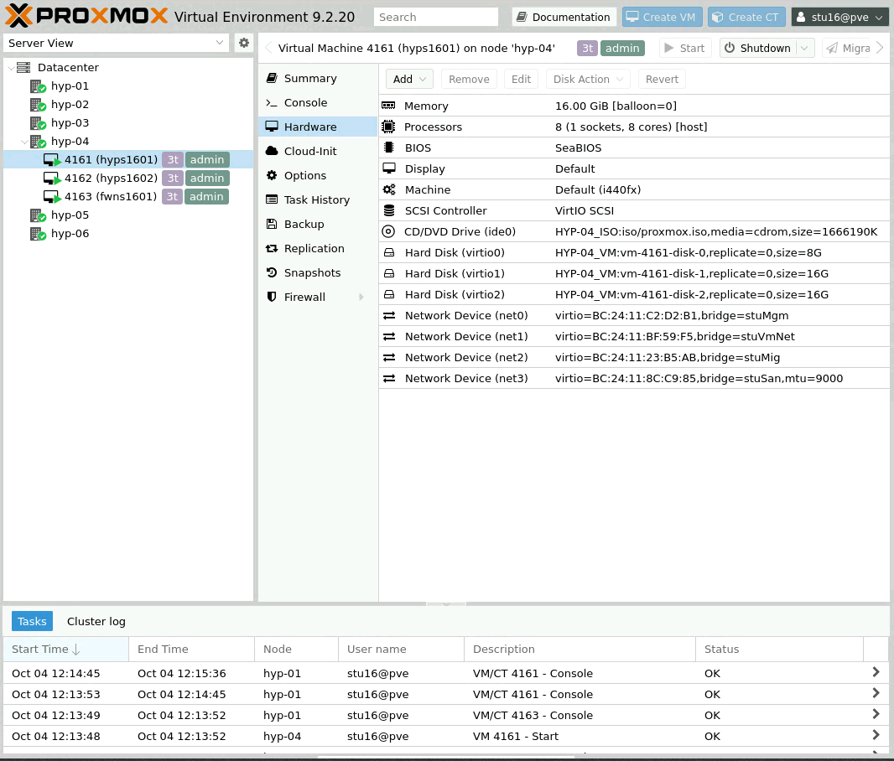
ici c'est l'interface proxmox professeur (hyp-04) sur la quel nous devont nous connecter pour lancer nos hyperviseurs proxmox student(hyps-1601, hyps-1602) qui sont virtualiser. nous avons aussi un firewall Pfsense (fwns1601)

si on fait un schema de notre infrastructure, on obtient :
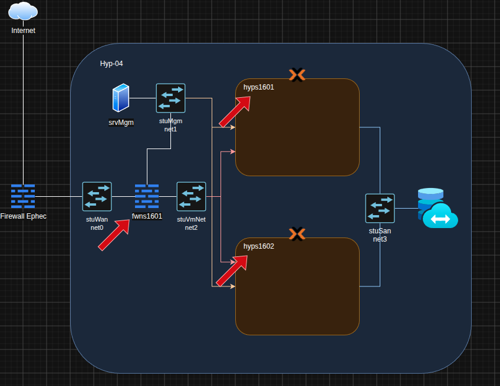
le fleche rouge indique les 3 vm virtualiser par l'hyperviseur parent (hyp-04)

l'infra sera encore modifier par la suite dans le cours

## 1. PfSense

### terminal installation
sur l'interface proxmox du professeur on va commencer par installer un firewall Pfsense (fwns1601) on lancer donc l'installation jusqu'a arriver a cette image : 
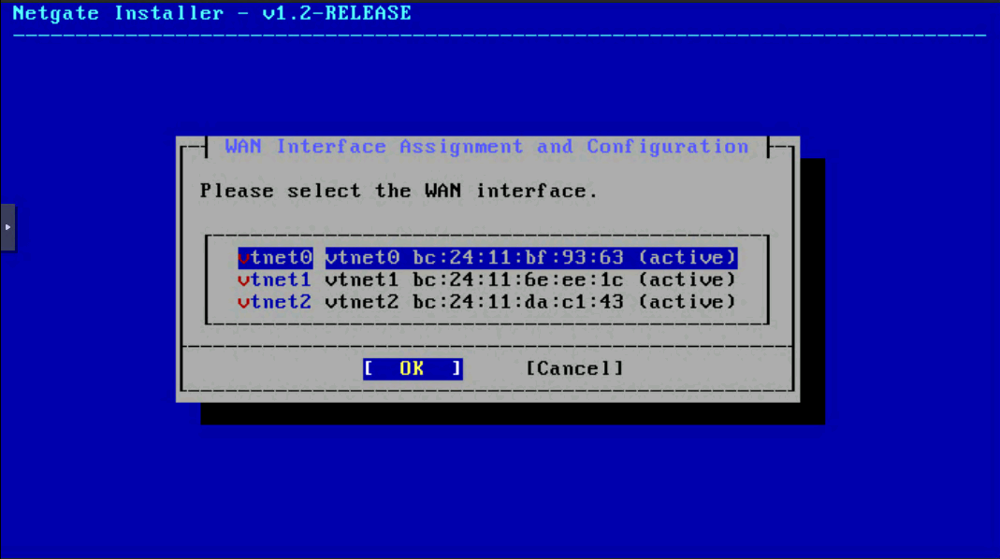
il nous demande de selectionner l'interface Wan
allons voir les interface disponibles et selectionner stuWan qui correspond a la sortie vers l'hyperviseur parent (hyp-04) : 
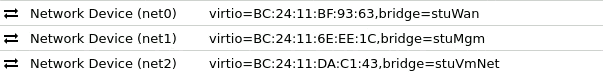
donc ici la vtnet0 est bien notre wan pour le firewall passont a la suite 

ensuite il faut configurer aussi l'adresse ip de notre wan en statique ici on utilise donc des adresse en 172.31.90.gid/24
et pour la gateway 172.31.90.254/24 le serveur dns a la meme adresse que la gateway 

ensuite nous ne devons pas installer l'interface lan pour le moment on peux donc passer a l'installation de pfsense CE

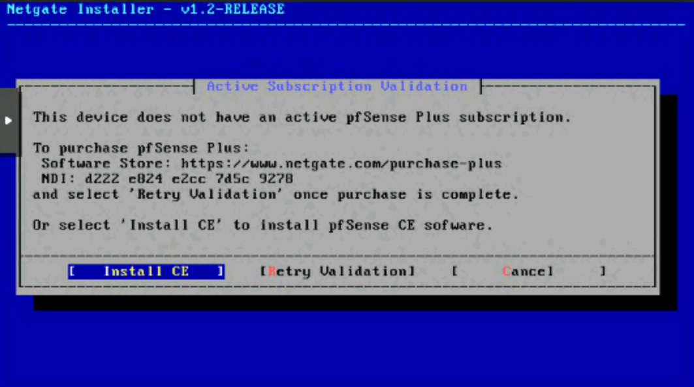

dans l'installation de pfsense CE on peux tout accepter par defaut
### terminal configuration
dans le terminal on doit configurer les interfaces du firewall donc dans l'image ci dessous on peux voir les options disponibles
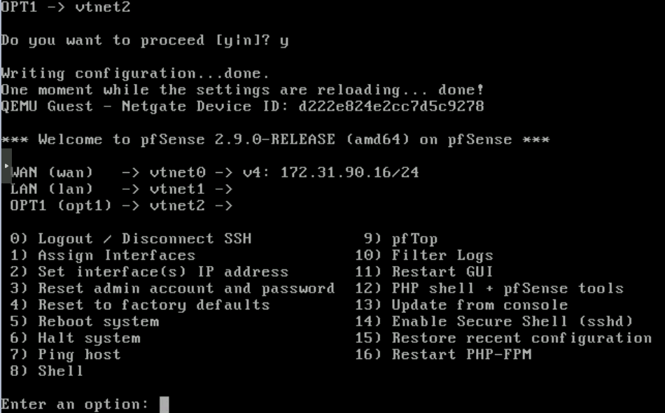
on selectionne donc `1) Assign Interface`

dans le labo il nous est demander de ne pas configurer de dhcp pour le moment sur les interface.
ensuite quand nous avons assigner les interface comme ceci :
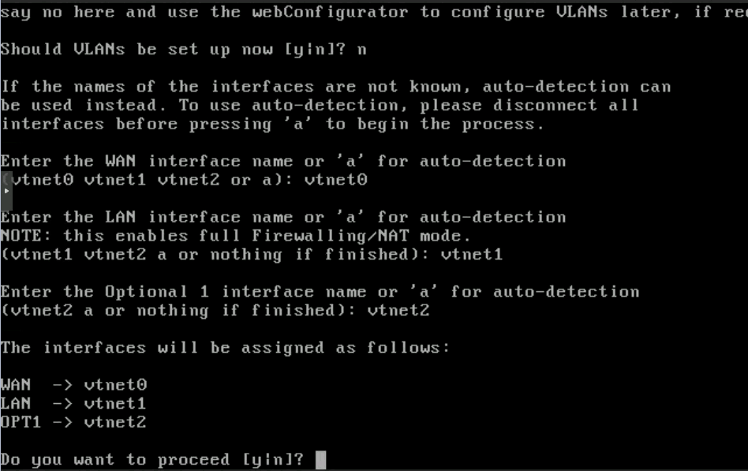

on peux passer a `2) Set Interface IP address`

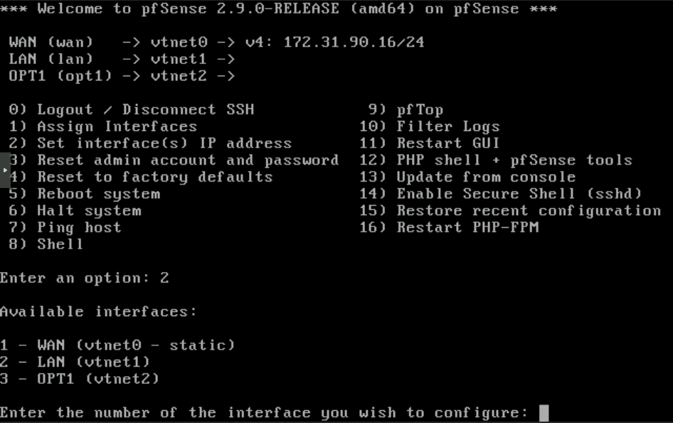

ici la wan a du déjà etre configurer ci ce n'est pas fait mettez l'adresse 172.31.90.gid/24
pour la lan mettez l'adresse 172.31.80.2gid/24 

maintenant que c'estt fait on peux passer a la configuration de l'interface web de pfsense.

### web interface installation

maintenant que pfsense est installé, on peux acceder a l'interface web de pfsense en entrant l'adresse ip 172.31.80.216

(le screenshot a été pris avant la configuration de l'ip sur le lan c'est pour sa que c'est pas la bonne adresse ip sur le screenshot)
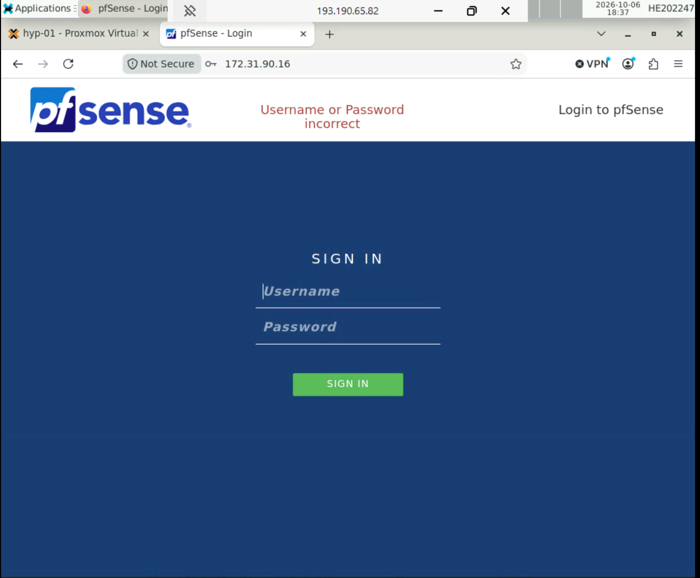

les identifiants de base de pfsense :
username : admin
password : pfsense

!!!!ATTENTION PREMIER CHOSE A FAIRE : CHANGER L'IDENTIFIANT ET LE MOT DE PASSE PAR DEFAUT!!!!

maintenant que nous avons changé l'identifiant et le mot de passe par défaut, il y a un probleme de logique dans les nom l'interface lan est enfait une interface pour manager le firewall on va donc changer son nom par MGM et le opt1 est notre vrai LAN qui servira ou sub-interfaces pour nos VMs.

il faut donc aller dans : Interface > LAN et changer la description en MGM save et ne pas oublier d'appliquer les changements.
ensuite : Interface > OPT1 et changer la description en VMNet save et ne pas oublier d'appliquer les changements.

on va maintenant configurer l'interface VMNet pour séparer le traffic on va donc configurer des VLAN.
pour notre vlan id sa sera gid0

aller dans : Interfaces > Assignments > VLANs 
puis cliquer sur + Add

ici bien selectionner la bonne interface et le vlan id

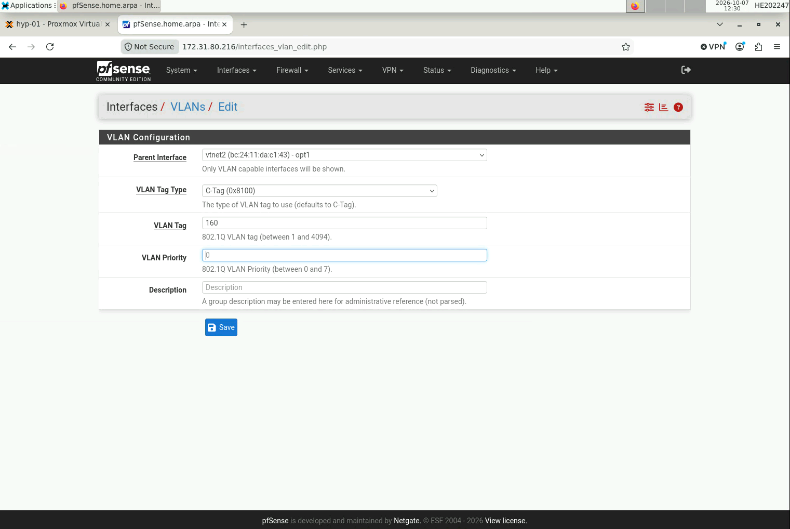

ensuite retourner dans interfaces > assignments et ajouter le vlan id comme interface a notre firewall.
on devrait avoir se résultat :

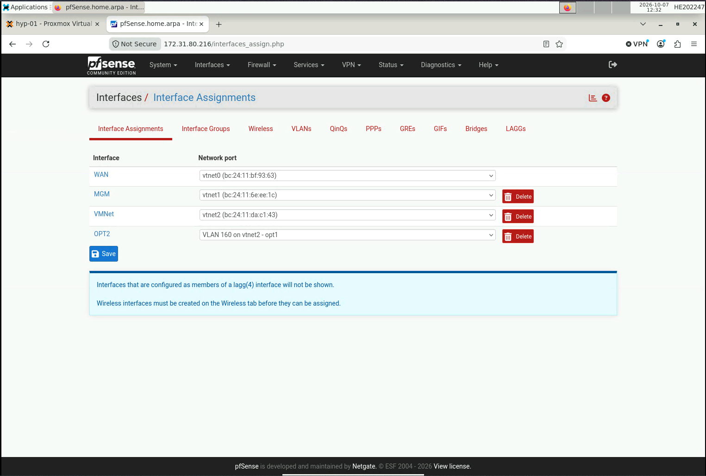
ensuite aller dans cette nouvelle interface pour la configurer :
cocher la case Enable interface
dans la section IPv4 selectionner configuration type pour static IPv4 une nouvelle section apparait pour configurer l'IPv4 du vlan.
on lui donne comme ip : 10.gid.0.254/24 ici ca sera la gateway de notre vlan  pour les VMs.

pour finir on va configurer un simple règle de firewall pour autoriser le trafic sur ce vlan & un serveur DHCP pour les VMs.

#### règle de firewall
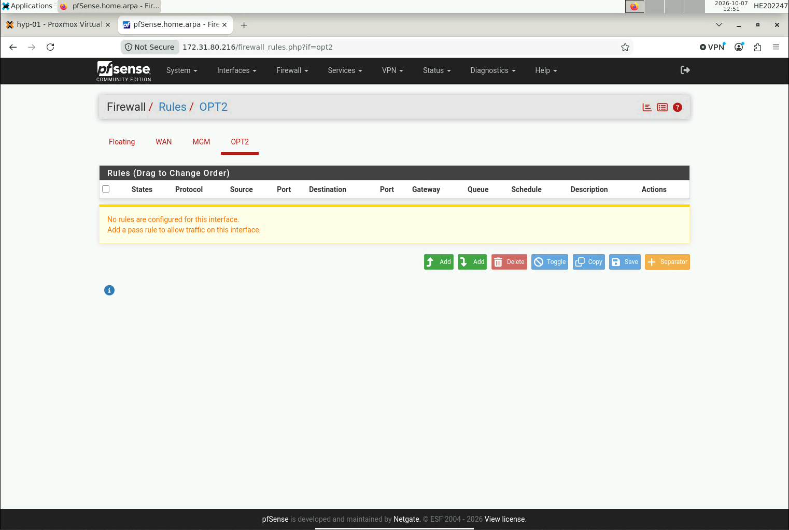
ici cliquer sur un des 2 add pour ajouter une règle de firewall.
dans cette règle on va mettre protocol en Any et source en Any meme chose pour destination.
save puis appliquer les changements.

#### serveur DHCP
allons maintenant dans services > DHCP server > OPT2
il faut juste cocher la case Enable DHCP server.
on peut aussi ajouter un pull d'adresses IP pour les VMs.
ici je vais mettre de 10.16.0.50  a 10.16.0.100 pour les VMs.
save puis appliquer les changements.

voila il ne reste plus qu'à tester si le firewall fonctionne correctement.(on verra sa par la suite) 
on peut tester que le jump server peux accéder à internet en pingant google.com par exemple.

## 2. Proxmox
