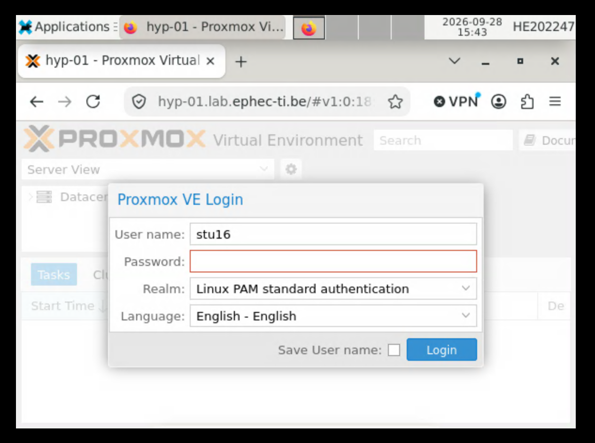
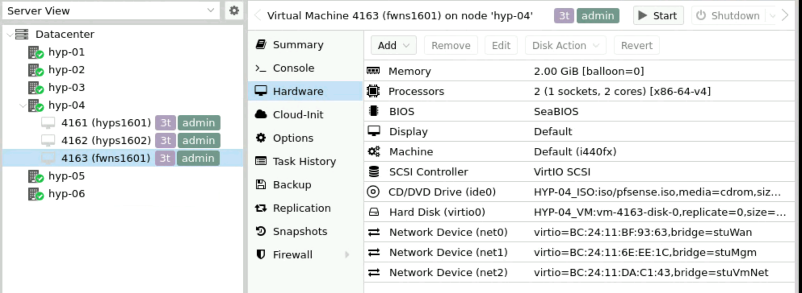
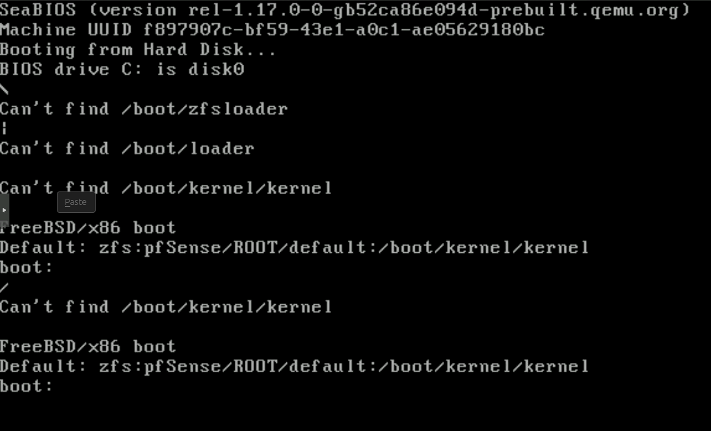

pour la partie RDP c'est le login individuel pas le nom de groupe

par exemple moi dans mon groupe 16 je doit aller dans RDP puis mettre cette adresse : 10.1.1.16(exemple ici)

login : HExxxxx
pwd : Test1234!

url./ ici il y a une erreur car il y a un . en trop l'adresse correcte c'est donc : the url

ici a gauche on peux voir nos machines donc les 2 hyperviseur du groupe 16 & notre firewall

GOAL :

## Troubleshoot firewall bug
en voulent configurer le firewall j'ai accidentellement couper la vm firewall j'ai eu donc ses erreur : 

pour solutionner le probleme il faut:  couper la vm -> relancer et accéder au bios avec esc -> seletionner pfsense
et voila
